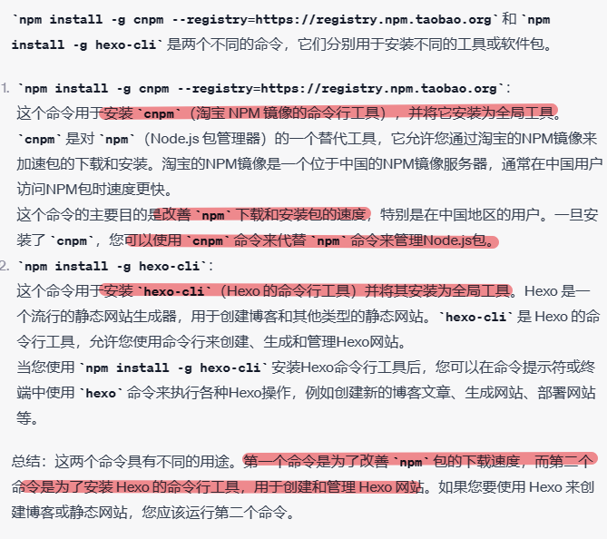
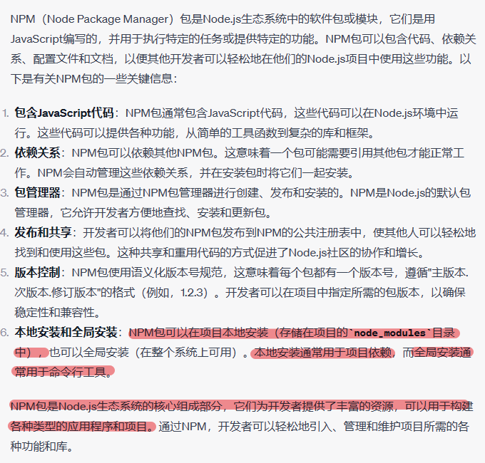
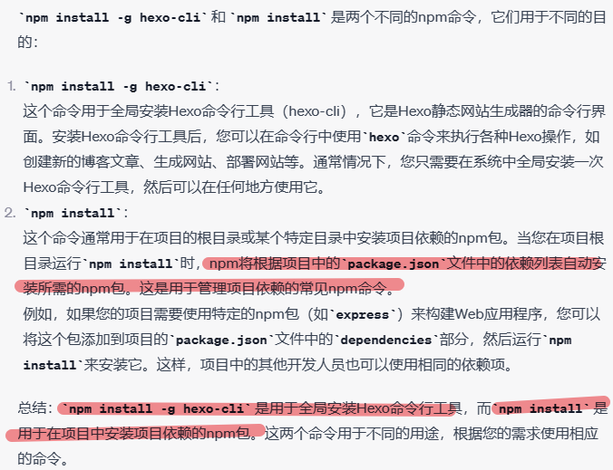
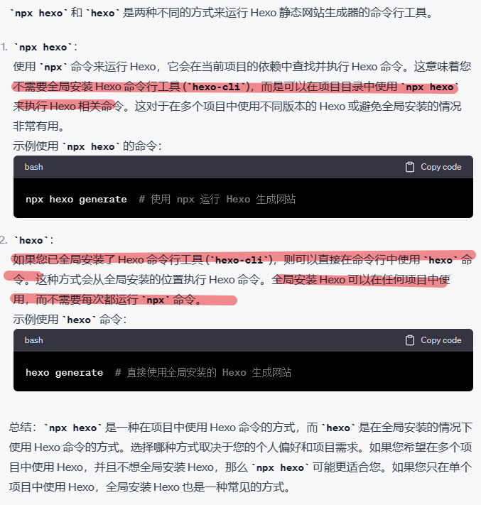
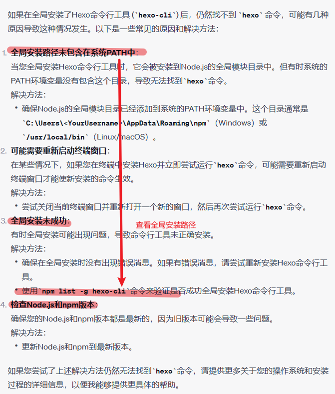
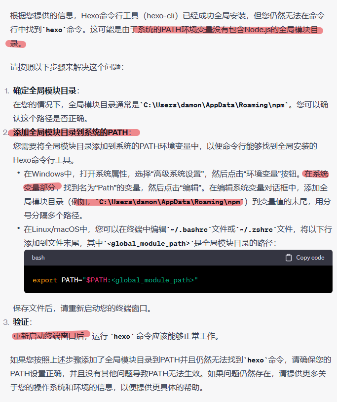
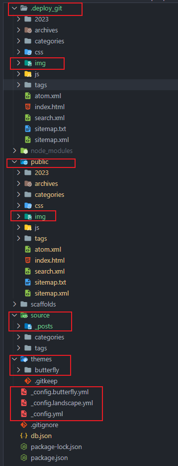
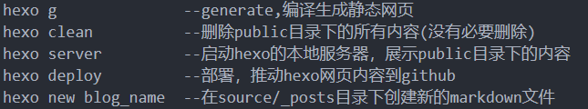
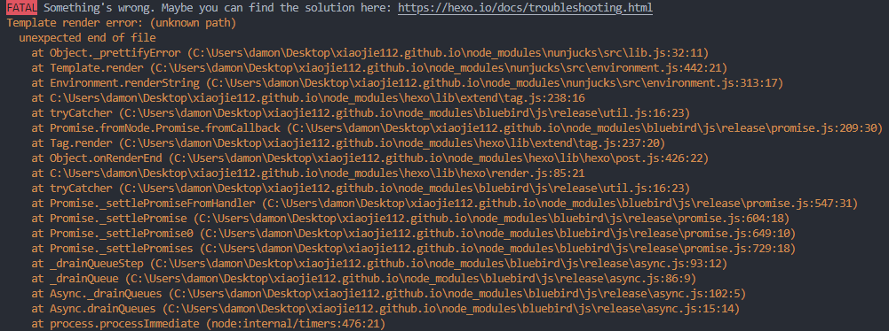

## 博客搭建基本流程
### 安装git, Node.js<br>

### 安装npm和hexo<br>

`npm install -g cnpm --registry=https://registry.npm.taobao.org`和`npm install -g hexo-cli`的区别  
  



npm包和node_modules




`npm install -g hexo-cli`和`npm install`的区别





`npx hexo`和 `hexo`的区别




通过`npm install -g hexo-cli`安装后仍然找不到hexo命令

总结来说就是hexo-cli被npm安装在Node.js的全局模块中，但是Node.js没有配置环境变量。     

添加Node.js的全局模块目录到系统的PATH中:
  

## hexo博客目录结构 
  


- .deploy_git需要使用`hexo deploy`推送至远程github仓库。
- _config.yml是整个博客项目的配置文件，_config.butterfly.yml是自己创建的用于替换主题目录下的。_config.yml文件, _config.butterfly.yml的优先级要比themes目录下各主题的_config.yml优先级要高。
- themes目录下是各个主题文件目录，也是git仓库，各自独立管理;顶层git仓库推送时不会将主题目录推送到远程仓库。
- source目录下即为博客markdown文件，经过`hexo g`编译后生成的静态文件放置在public目录下。
- public目录下的img文件不会在编译时自动生成，需要从source目录下手动拷贝过来。注意通过浏览器访问博客中的图片时，根路径都是`img`, 比如`http://localhost:4000/img/blog_build/image-8.png`,因此markdown中图片的根路径也必须为`img`,比如` `。
- public目录下的img文件也需要手动拷贝到.deploy_git目录下的img中。


## hexo常用命令
<!--    -->
```shell
hexo g        --generate,编译生成静态网页
hexo clean      --删除public目录下的所有内容(没有必要删除)
hexo server     --启动hexo的本地服务器，展示public目录下的内容
hexo deploy     --部署，推动hexo网页内容到github
hexo new blog_name  --在source/_posts目录下创建新的markdown文件
```

## hexo博客备份
目前个人仓库xiaojie112.github.io中有两个分支，分支main用于部署hexo博客页面(即hexo编译得到的前端页面), 分支hexo是博客源文件, 分支hexo被我修改为default分支，即clone拉取和push提交都是在这个分支上进行，但是hexo deploy是在main分支上进行，这在博客根目录下的_config.yml中进行了配置

```yaml
\# Deployment
\## Docs: https://hexo.io/docs/one-command-deployment
deploy:
 type: git
 repository: git@github.com:xiaojie112/xiaojie112.github.io.git
 branch: main
```

根目录下的.git属于博客源文件的git仓库，通过`git push`推送到远程分支hexo。.deploy_git属于编译得到的静态页面，通过`hexo d`推送到远程分支main。两者互不冲突。themes目录下的主题仓库独立更新和克隆。


## BUG
  
对于单行代码请使用单个反引号包围单行代码，对于多行代码使用3个反引号包含多行代码块，否则编译报错
  




## 其它


## REFERENCE
参考：
1. [hexo搭建个人博客](https://blog.csdn.net/weixin_45019350/article/details/121901433?ops_request_misc=%7B%22request%5Fid%22%3A%22169365558316800188546837%22%2C%22scm%22%3A%2220140713.130102334..%22%7D)
2. [hexo搭建个人博客及hexo源码分支和页面分支管理](https://blog.csdn.net/sinat_37781304/article/details/82729029?ops_request_misc=%257B%2522request%255Fid%2522%253A%2522169365558316800188546837%2522%252C%2522scm%2522%253A%252220140713.130102334..%2522%257D&request_id=169365558316800188546837&biz_id=0&utm_medium=distribute.pc_search_result.none-task-blog-2~all~top_positive~default-1-82729029-null-null.142^v93^chatsearchT3_2&utm_term=hexo%E6%90%AD%E5%BB%BA%E4%B8%AA%E4%BA%BA%E5%8D%9A%E5%AE%A2&spm=1018.2226.3001.4187)
3. [butterfly示例博客](https://butterfly.js.org/link/#%E7%A4%BA%E4%BE%8B)
4. [hexo备份](https://blog.fufu.ink/2023/02/hexobackuphouhou.html)
5. [butterfly document](https://butterfly.js.org/en/posts/butterfly-docs-en-get-started/)
<br>


默認 提示塊標籤



default 提示塊標籤



primary 提示塊標籤



success 提示塊標籤



info 提示塊標籤



warning 提示塊標籤



danger 提示塊標籤

