
问题起源:在使用`hexo`搭建博客的过程中，需要将博客源码备份至github仓库，但是出现了git仓库嵌套的情况，即博客根目录的git仓库和`themes/butterfly`目录下的git仓库出现嵌套，`themes/butterfly`下的内容无法被推送到远程仓库。


## 场景实验
### 场景一
按步骤进行如下操作：
- 分别准备temp1和temp2两个仓库并推送到远程仓库中，将temp2克隆到temp1中，然后删除temp2中的.git目录，接着将temp1推送到远程仓库，观察发现temp2也被推送到远程仓库。
- 在temp1中克隆temp2，观察`git submodule status`没有任何输出，说明此时temp2没有被加入temp1的子仓库管理。
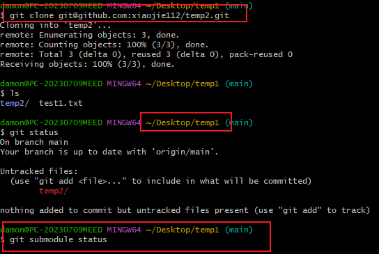
- 使用`git push`成功将temp1推送到远程仓库，同时子目录temp2也被推送到远程仓库。
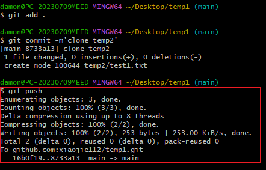
- temp1中此时有一个子目录temp2，再次克隆temp2到temp1中,克隆失败。  
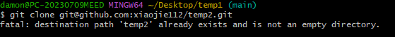

### 场景二
按步骤进行如下操作：
- 先分别准备temp1和temp2两个仓库并推送到远程仓库中，将temp2克隆到temp1中，不要删除temp2中的.git目录，`git status`可以看到temp2为`untracked files`，但是直接将temp1推送到远程仓库并没有报错，而是显示`everything up-to-date`，观察temp2并没有被推送到远程仓库，因为temp2中存在.git文件夹，因此temp2不会被temp1中的git仓库管理，也就不会推送到远程仓库。  
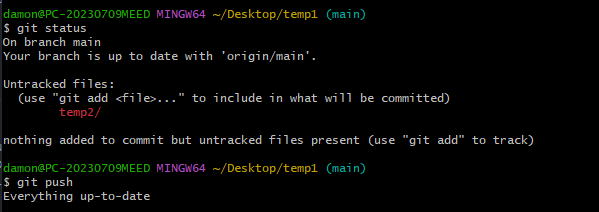        
- 此时在temp1目录下`git add temp2`，然后提交推送到远程仓库,远程仓库虽然存在temp2目录，但是temp2中的文件并没有推送到远程仓库中。  
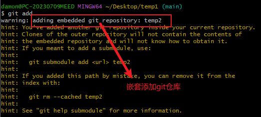


### 场景三
- temp1仓库中有一个目录temp3，此时将temp3初始化为一个新的仓库，temp1中`git status`可以看到temp3被识别为`untracked files`，此时直接`git push`显示`everything up-to-date`。  
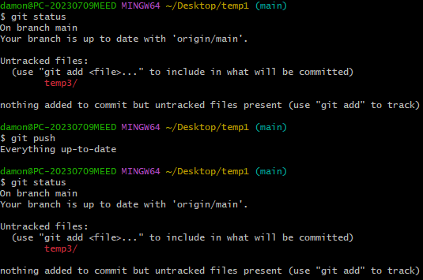


## 创建submodule
先分别准备demo1和demo2两个仓库并推送到远程仓库中。
在demo1中使用`git submodule add <submodule_url>`命令将demo2添加为demo1的子模块。 
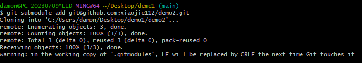此时项目仓库中会多出两个文件：`.gitmodules`和`demo2`。
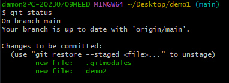在.gitmodules文件文件内容中多出三行记录。
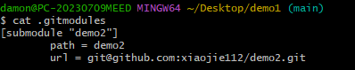事实上，此时在`.git/config`文件中也会多出一些信息，在`.git/modules`文件夹下也会多出一份内容。通常此时可以使用`git commit -m "add submodule xxx"`提交一次，表示引入了某个子模块。推送到远程仓库后，在主项目仓库中，会显示出子模块文件夹，并带上其所在仓库的版本号。  
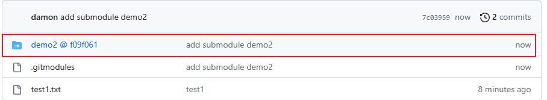  

## 获取submodule
上述步骤在创建子模块的过程中，会自动将相关代码克隆到对应路径，但对于后续使用者而言，对于主项目使用普通的 clone 操作并不会拉取到子模块中的实际代码。使用`git clone`命令进行克隆，完成后demo2文件夹是空的。
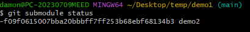但是demo1子模块的信息是存在的。所以可以根据主项目的配置信息，使用如下命令拉取更新子模块中的代码。
```shell
git submodule init
git submodule update
```
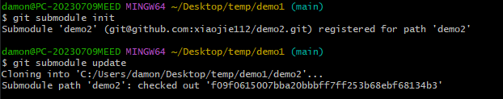如果克隆的时候希望子模块代码也获取到，可以在克隆主项目的时候带上参数 `--recurse-submodules`，这样会递归地将项目中所有子模块的代码拉取。  
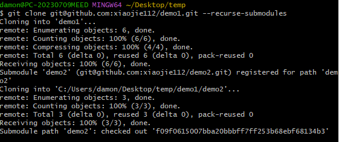  

## 子模块的更新和删除
对于主项目而言，子模块的内容发生变动时，通常有三种情况：  
1）当前项目下子模块文件夹内的内容发生了未跟踪的内容变动；  
2）当前项目下子模块文件夹内的内容发生了版本变化；  
3）当前项目下子模块文件夹内的内容没变，远程有更新；  
针对这三种情况有不同的解决方案，直接参考下文列出的博客；删除子模块也比较麻烦，需要手动删除相关的文件，也可直接参考下文列出的博客。

## 总结
当项目比较复杂，部分代码希望独立为子模块进行版本控制时，可以使用`git submodule`功能。
使用`git submodule`功能时，主项目仓库并不会包含子模块的文件，只会保留一份子模块的配置信息及版本信息，作为主项目版本管理的一部分。


## 参考
- [Git: submodule 子模块简明教程](https://zhuanlan.zhihu.com/p/404615843)
- [Git中submodule的使用](https://zhuanlan.zhihu.com/p/87053283)